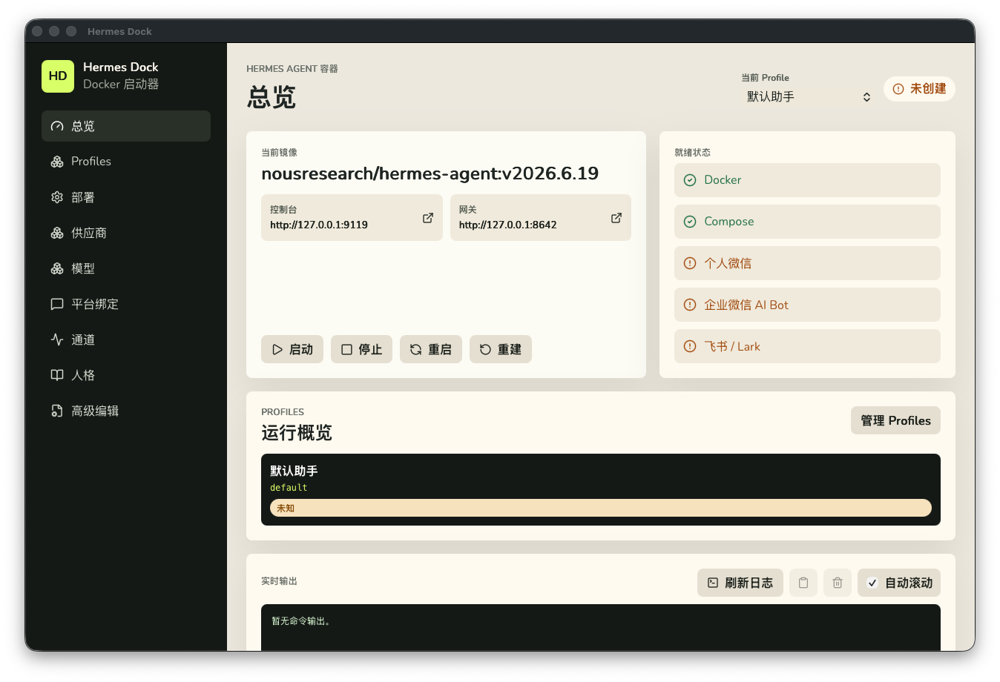
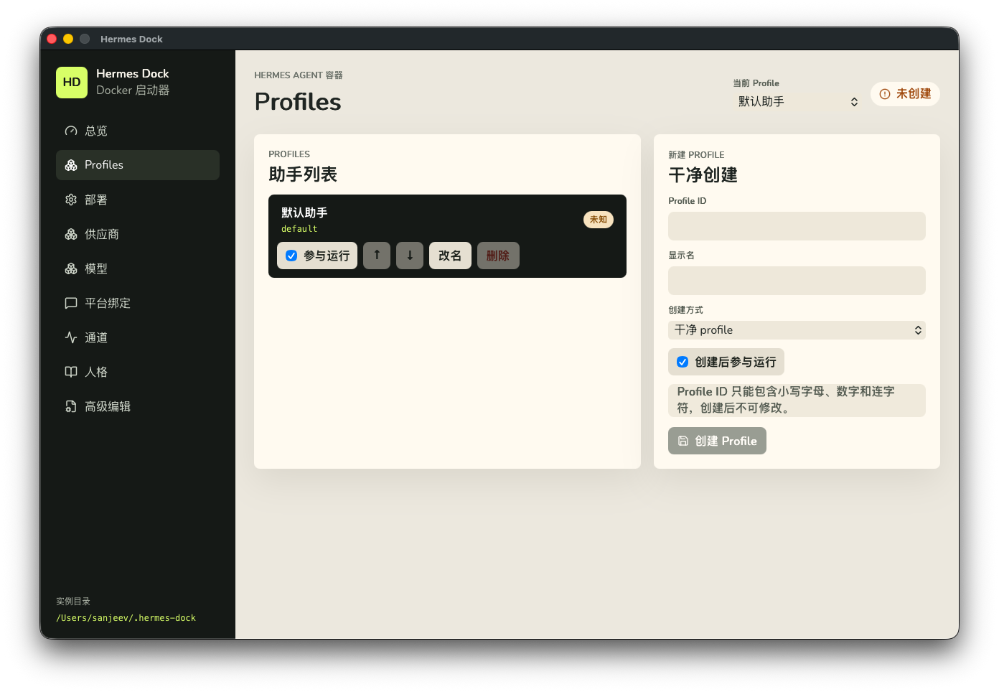
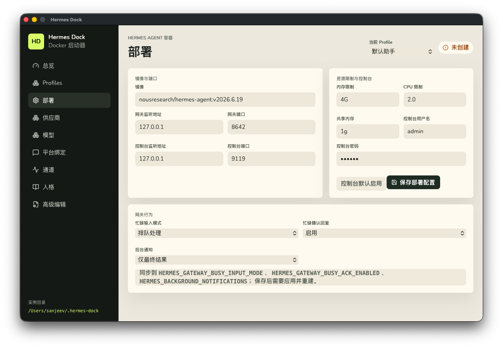
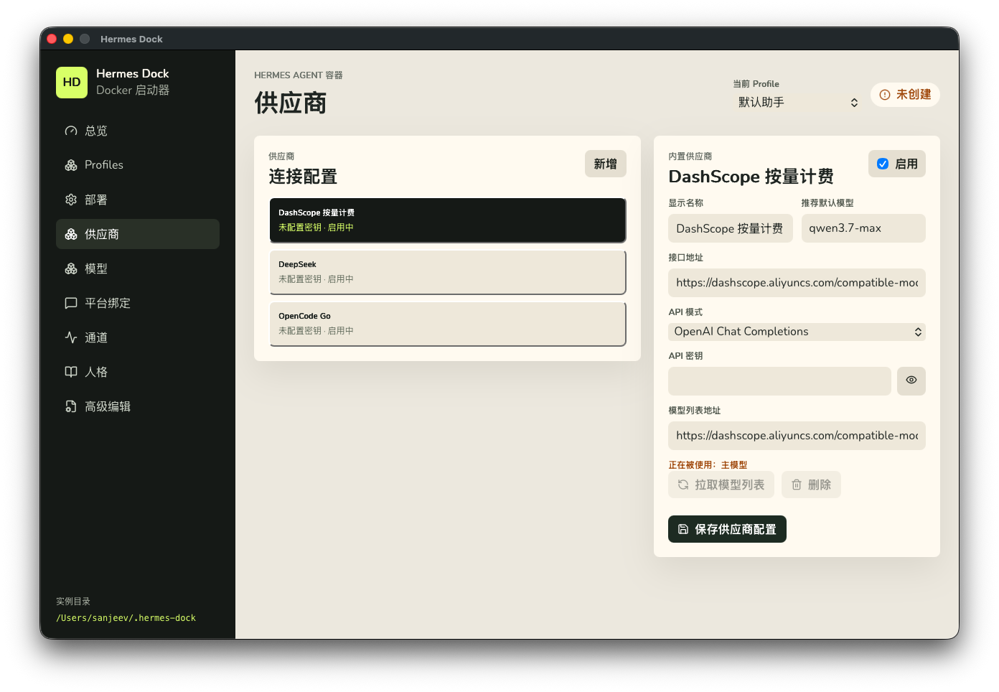
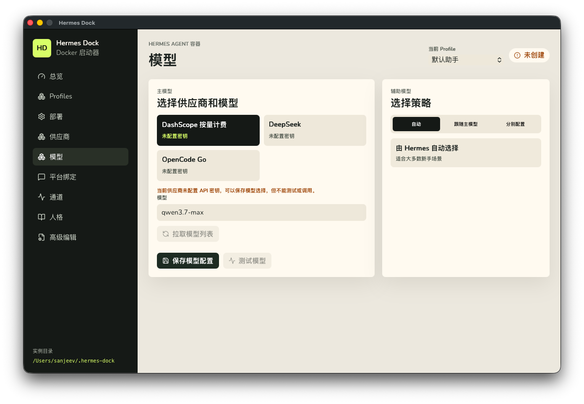
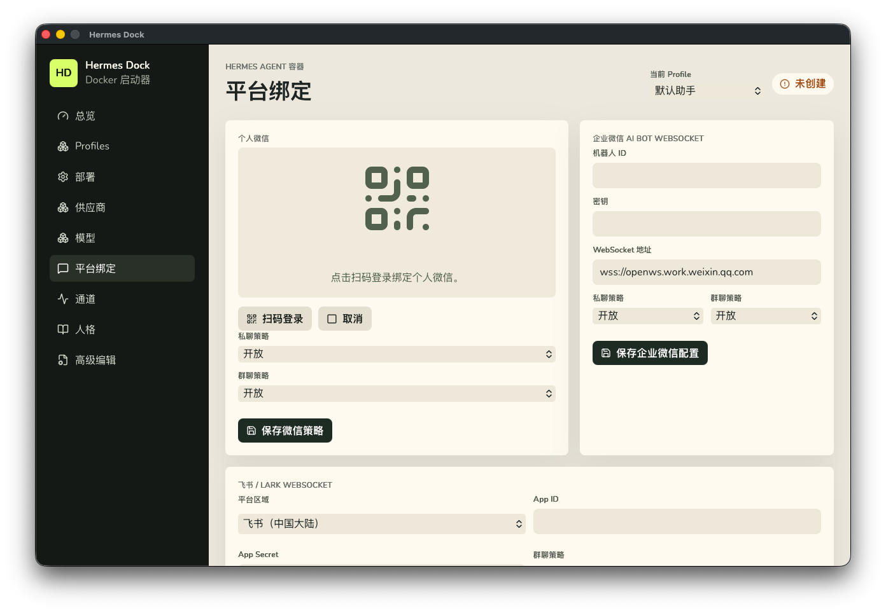
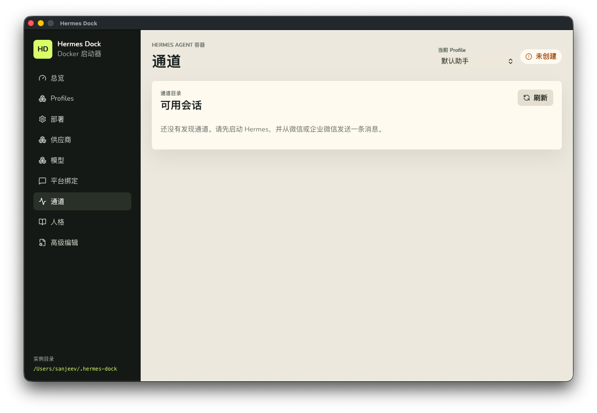
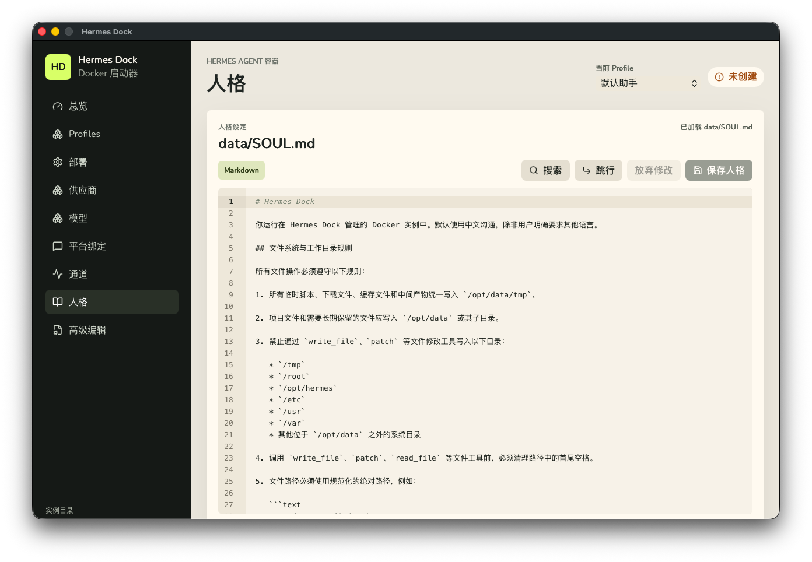
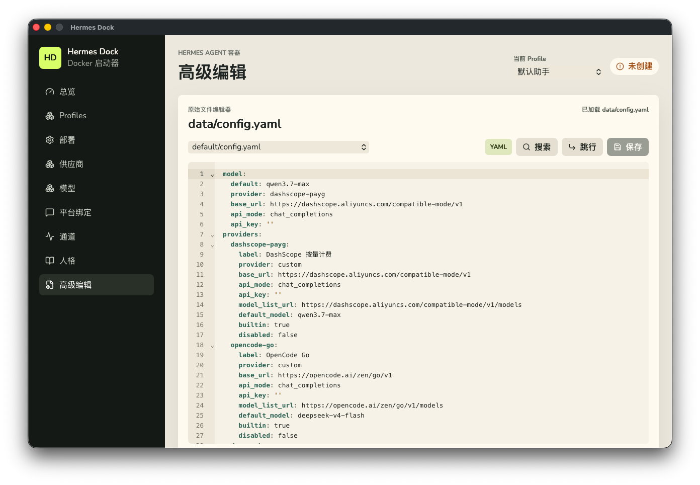

# Hermes Dock 用户操作手册

适用版本：Hermes Dock 1.0.17
最后更新：2026-06-30

Hermes Dock 是一个本地桌面启动器，用来通过图形界面管理当前用户的 Hermes Agent Docker 实例。它会管理固定目录 `~/.hermes-dock`，帮助你完成初始化、部署配置、模型配置、平台绑定、启动、停止、重建和日志查看。

本手册面向普通用户。除非进入“高级编辑”，日常使用不需要手动编辑配置文件或执行 Docker 命令。



## 1. 使用前准备

使用 Hermes Dock 前，请先确认本机已经安装并启动 Docker。Hermes Dock 不负责安装 Docker，只检测 Docker 和 Docker Compose 是否可用。

首次打开 Hermes Dock 时，应用会自动创建：

```text
~/.hermes-dock
```

这个目录保存 Hermes 的配置、数据、平台凭据、启动器状态和备份。默认情况下，Hermes Dock 不会覆盖已有用户数据；只有你明确保存配置、绑定平台、删除 profile 或执行恢复出厂设置时，才会写入或删除相关文件。

## 2. 快速上手流程

第一次使用建议按下面顺序操作：

1. 打开 Hermes Dock，进入“总览”页，确认 Docker 和 Compose 状态正常。
2. 进入“供应商”页，选择一个模型供应商，填写 API 密钥并保存。
3. 进入“模型”页，选择主模型，必要时拉取模型列表，然后保存模型配置。
4. 进入“平台绑定”页，至少绑定一个入口，例如个人微信、企业微信 AI Bot 或飞书 / Lark。
5. 回到“总览”页，点击“重建”或顶部提示条中的“重建”，让已保存配置进入运行态。
6. 容器启动后，可打开“控制台”或在“通道”页刷新可用会话。

保存部署、供应商、模型、平台绑定、默认通道或 profile 启停后，界面会提示“配置已保存，重建后生效”。这表示文件已经保存，但旧容器还没有加载新配置。请点击“重建”应用变更。

## 3. 界面概览

左侧导航包含这些页面：

- “总览”：查看容器状态、打开控制台和网关、启动/停止/重启/重建容器、查看日志。
- “Profiles”：管理多个助手 profile，包括创建、改名、排序、启停和删除。
- “部署”：配置 Docker 镜像、端口、控制台账号密码、资源限制和网关行为。
- “供应商”：配置模型供应商、API 密钥、接口地址和模型列表地址。
- “模型”：选择主模型和辅助模型策略，并测试模型。
- “平台绑定”：绑定个人微信、企业微信 AI Bot、飞书 / Lark。
- “通道”：查看已发现的会话通道，设置个人微信默认通道，发送测试消息。
- “人格”：编辑当前 profile 的 `SOUL.md`。
- “高级编辑”：编辑当前 profile 的 `config.yaml`、`.env` 和 `docker-compose.override.yaml`，以及执行恢复出厂设置。

顶部“当前 Profile”下拉框用于切换正在编辑的 profile。切换 profile 前，请先保存或放弃“人格”和“高级编辑”里的未保存修改。

## 4. 总览

“总览”页显示当前镜像、控制台地址、网关地址、就绪状态、Profiles 运行概览和实时输出。

常用按钮：

- “启动”：执行 `docker compose up -d`，启动 Hermes 容器。
- “停止”：执行 `docker compose stop`，停止容器但保留数据。
- “重启”：执行 `docker compose restart`，重启现有容器。
- “重建”：执行 `docker compose up -d --force-recreate`，重新创建容器并加载最新配置。
- “刷新日志”：读取容器日志。
- “复制日志”：复制当前日志框内容。
- “清空日志”：只清空界面上的日志显示，不删除容器日志文件。

控制台和网关卡片可以直接打开对应地址。默认地址通常是：

```text
控制台：http://127.0.0.1:9119
网关：http://127.0.0.1:8642
```

默认控制台账号密码来自“部署”页，初始值为 `admin` / `123456`。首次使用后建议尽快修改密码并保存，然后重建容器。


## 5. Profiles

Profile 用来隔离不同助手的人格、模型、平台绑定、通道、记忆和会话。`default` profile 使用 `~/.hermes-dock/data`，不能删除，但可以停用。其他 profile 位于 `~/.hermes-dock/data/profiles/<id>`。

在“Profiles”页可以：

- 点击 profile 行切换当前编辑对象。
- 勾选或取消“参与运行”，控制该 profile 是否参与容器运行。
- 点击“上移”“下移”调整显示顺序。
- 点击“改名”修改显示名。
- 点击“删除”删除非 `default` profile。

创建 profile 时需要填写：

- “Profile ID”：只能包含小写字母、数字和连字符，创建后不可修改，不能使用 `default`。
- “显示名”：界面展示名称，可以使用中文。
- “创建方式”：可以选择“干净 profile”，也可以选择“复制当前 profile 的人格和 skills”。
- “创建后参与运行”：是否立即加入运行清单。

删除非 `default` profile 前，Hermes Dock 会先整体备份 profile 目录。备份失败时会中止删除。



## 6. 部署

“部署”页用于配置 Docker 容器和网关行为。

“镜像与端口”区域包含：

- “镜像”：Hermes Docker 镜像，默认是 `nousresearch/hermes-agent:v2026.6.19`。
- “网关监听地址”和“网关端口”：控制 Hermes 网关对本机暴露的地址和端口。
- “控制台监听地址”和“控制台端口”：控制 Hermes 控制台地址和端口。

“资源限制与控制台”区域包含：

- “内存限制”：默认 `4G`。
- “CPU 限制”：默认 `2.0`。
- “共享内存”：默认 `1g`。
- “控制台用户名”和“控制台密码”：控制台登录凭据。

“网关行为”区域包含：

- “忙碌输入模式”：可选择“排队处理”“引导当前任务”或“中断当前任务”。
- “忙碌确认回复”：控制忙碌时是否自动回复确认消息。
- “后台通知”：控制运行更新和最终结果的通知策略。

端口必须是 `1-65535` 之间的数字。保存部署配置后，需要重建容器才会生效。



## 7. 供应商

“供应商”页管理模型服务连接配置。内置供应商包括：

- DashScope 按量计费
- OpenCode Go
- DeepSeek

每个供应商可以配置：

- “显示名称”：界面展示名称。
- “推荐默认模型”：该供应商推荐使用的模型名。
- “接口地址”：模型服务的 Base URL。
- “API 模式”：OpenAI Chat Completions 或 Anthropic Messages。
- “API 密钥”：模型服务密钥。
- “模型列表地址”：用于拉取模型列表的接口地址。

填写 API 密钥和接口地址后，可以点击“拉取模型列表”。拉取成功后，可从列表中选择推荐默认模型。

点击“保存供应商配置”后，配置会写入当前 profile。内置供应商不能删除；自定义供应商如果正在被主模型或辅助模型使用，也不能删除。



## 8. 模型

“模型”页用于选择当前 profile 的主模型和辅助模型策略。

主模型配置流程：

1. 在供应商卡片中选择一个已启用供应商。
2. 在“模型”输入框中手动填写模型名，或点击“拉取模型列表”后从下拉列表选择。
3. 点击“保存模型配置”。
4. 如供应商已配置 API 密钥，可以点击“测试模型”确认连接是否正常。

辅助模型策略有三种：

- “自动”：由 Hermes 自动选择，适合大多数新手场景。
- “跟随主模型”：所有辅助用途使用主模型。
- “分别配置”：为视觉理解、网页提取、上下文压缩、审批、MCP 配置等用途分别选择供应商和模型。

如果供应商没有 API 密钥，可以保存模型选择，但不能测试或实际调用该模型。



## 9. 平台绑定

“平台绑定”页把当前 profile 连接到聊天入口。一个 profile 可以同时绑定个人微信、企业微信 AI Bot 和飞书 / Lark。

### 9.1 个人微信

个人微信通过扫码登录绑定：

1. 点击“扫码登录”。
2. 使用微信扫描界面上的二维码。
3. 等待状态显示绑定成功。
4. 回到顶部提示条或“总览”页点击“重建”。

个人微信私聊和群聊默认开放，页面不再提供策略配置。

### 9.2 企业微信 AI Bot

企业微信只支持 AI Bot WebSocket 模式。需要填写：

- “机器人 ID”
- “密钥”
- “WebSocket 地址”，默认 `wss://openws.work.weixin.qq.com`
- “私聊策略”
- “群聊策略”

企业微信私聊和群聊策略只支持“开放”和“关闭”。旧版本的名单配置在保存后会被清空。

填写完成后点击“保存企业微信配置”，然后重建容器。

### 9.3 飞书 / Lark

飞书 / Lark 使用 WebSocket 模式。需要填写：

- “平台区域”：中国大陆选择“飞书”，海外选择“Lark”。
- “App ID”
- “App Secret”
- “群聊策略”

飞书 / Lark 群聊策略只支持“开放”和“关闭”。旧版本的名单配置在保存后会被清空。

填写完成后点击“保存飞书配置”，然后重建容器。



## 10. 通道

“通道”页显示 Hermes 已发现的会话通道。容器启动并收到来自微信、企业微信或飞书的消息后，通道列表才会出现内容。

可以执行的操作：

- “刷新”：重新读取通道目录。
- “设为默认”：将某个个人微信通道设为默认通道。
- “测试”：向对应通道发送 `Hermes Dock 测试消息`。

如果列表为空，请先确认：

- 容器已经启动。
- 当前 profile 已绑定平台并参与运行。
- 对应平台已经向 Hermes 发送过至少一条消息。
- 保存平台配置后已经重建容器。



## 11. 人格

“人格”页用于编辑当前 profile 的 `SOUL.md`。这是给 Hermes Agent 的人格和行为说明。

编辑器支持：

- 搜索
- 跳转到行
- 放弃修改
- 保存人格

保存后，文件已经写入当前 profile。为了让运行中的容器稳定加载最新人格，建议点击“重建”。



## 12. 高级编辑

“高级编辑”页面向熟悉配置文件的用户。普通用户优先使用“供应商”“模型”“部署”和“平台绑定”等结构化页面。

可编辑文件包括：

- 当前 profile 的 `config.yaml`
- 当前 profile 的 `.env`
- 全局 `docker-compose.override.yaml`

界面会根据当前 profile 自动切换文件路径。例如当前 profile 是 `sales` 时，`config.yaml` 路径是：

```text
data/profiles/sales/config.yaml
```

编辑器支持搜索、跳行和保存。保存前请确认 YAML 或 `.env` 格式正确；格式错误可能导致运行失败。

### 恢复出厂设置

“恢复出厂设置”会停止并移除 Hermes 容器，删除整个 `~/.hermes-dock` 目录，然后重新释放内置模板。该操作不可撤销，会删除本地配置、数据、平台凭据和本地备份。

执行前需要在确认框中输入：

```text
删除 ~/.hermes-dock
```

只有确实需要从零开始时才使用此功能。



## 13. 日常使用建议

建议按下面方式维护实例：

- 修改模型、平台、部署、profile 启停或默认通道后，及时点击“重建”。
- 不要手动删除 `~/.hermes-dock/data`，这里保存用户数据。
- 不要把 API Key、token 或 secret 复制到日志、截图或公开 issue 中。
- 高级 Docker 自定义写入 `docker-compose.override.yaml`，不要依赖手改标准 `docker-compose.yaml`。
- 多 profile 场景下，先确认顶部“当前 Profile”正确，再修改模型、人设或平台绑定。

## 14. 常见问题

### 保存配置后为什么没有生效？

已创建的 Docker 容器不会自动刷新环境变量。保存配置后，请点击“重建”，让新容器加载最新配置。

### 总览页显示 Docker 或 Compose 不可用怎么办？

请先确认 Docker Desktop 或 Docker 服务已经启动，并且当前系统可以运行 Docker Compose。Hermes Dock 只检测和调用 Docker，不负责安装 Docker。

### 通道页为什么没有任何会话？

通道需要 Hermes 启动后收到平台消息才会生成。请确认容器运行中、平台绑定完整、当前 profile 参与运行，并从对应聊天平台发送一条消息后再刷新。

### 可以同时管理多个 Docker 实例吗？

不可以。Hermes Dock 只管理当前用户下的单个 `~/.hermes-dock` 实例。多个助手通过 Profiles 在同一个容器内隔离运行。

### 删除 profile 会影响 default 吗？

删除非 `default` profile 只影响该 profile 的目录和配置。`default` profile 不能删除，只能停用。删除前会先尝试备份 profile 目录，备份失败会中止删除。

### API 密钥保存在哪里？

模型和平台密钥保存在当前 profile 的本地配置文件中，例如 `.env` 和相关平台账号目录。Hermes Dock 的启动器状态文件不会保存密钥。
